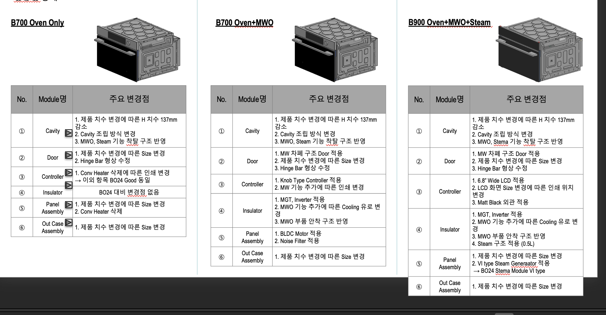

# 파이프 라인

# 1. 현재 목표

심의회 pptx와 기존 모델 정보인 base_bom정보를 기반으로, 새로 변경되는 내역을 pptx에서 추출하여, 변경 내역을  기반으로 과거 이력을 추천받아, 관련된 과거 이력에서 해당 변경을 시행했을 시, 어떻게 변경되었는지 변경 부품 정보를 확인한 후, 그 데이터를 기반으로 base_bom에 새로 변경되는 내역을 반영하여 new_bom작성을 요한다.

### Input

심의회 ppt(이번 모델에서 바뀔 부분들,  변경 내역),  base_bom.xlsx(개발하기 전 기본 model)

**최종 Output** 

1. new_bom.xlsx(base_bom에 pptx에 해당하는 변경내역을 반영하여 트리를 재작성한 파일) 

 2.개발 부품 변경리스트(변경 내역만 포함된 파일)

# 2. 파이프라인 단계, 단계별 고려 사항

## step 1. pptx에서 데이터 추출

- 이러한 변경점에 대한 내용이 나와있는 슬라이드에서 각 변경점을 추출 진행
- 공통적으로 추출/ 추출 할 수있는 내용들 : (1) module명, (2) 변경점 , (3) 변경사유

#### 변경내역, 변경점, module명의 의미

- 변경점, 변경 내역 → 해당 모듈에서 어떤부분이 변경되었는지  작성(같은 변경점이라도, 작성자에 따라 차이 존재)
- module명 → 신규 모델 개발 시 변경이 생기는 상위 모듈명(상위 모듈명이라고하나, pptx와 실제 base_bom,과거 이력 master과 정확히 매칭되는 실제 상위 모듈명과는 차이가 존재, 작성자에 따라 차이 존재)

#### 파악된 문제점

1. 입력되는 pptx마다 해당 변경점 요약되어 있는 부분이 다 다르고, 어떤 내용이 포함되어 있을지는 미지수 → 현재 슬라이드별로 각각 텍스트 파싱을 진행하고, llm에 파싱 진행(어느정도 해결)
2. 모델의 변경이 있는 이 **변경점을 찾는게 핵심**인데*위 모듈명에 대한 명칭만 존재하므로, **하위에 어떤 부품이 있는지를 특정 후**, 정확한 변경이 적용될 부품의 추정은 '주요 변경점'에서 추출을 진행해야 함"*
→ 단순 모듈명으로 유사한 내용 조회해서 변경점들을 비교하기엔 무리가 존재 

#### 현재 접근 중인 아이디어

1. 기존 History 이력을 기반으로  
2. **상위 모듈명 - 하위 모듈명 값을 엮어서 context**를 제공 예정 → 상위 모듈에는 하위 모듈이 어떤게 존재했는지, 그 모듈이 어떤 변경점을 가지는 지를 매핑시켜, 추출 상위 모듈명에 하위 모듈명이 어떤 것들이 존재했는지를 보여준 후, 그 중에 변경점을 어디에 매핑 시켜야 될지 context로 주기
3. 입력된 슬라이드별로 양식 차이는 슬라이드 별로 각각 파싱을 진행해서, 슬라이드별로 추출할 수 잇는 정보들 호출 진행

#### 정리

1. 슬라이드별 pptx 텍스트 뽑기
2. llm호출을 이용하여 뽑을 수 있는 내용 뽑기
3. 뽑은 내용 바탕으로 뽑은 과거데이터 변경점, 적용될 실제 부품명(bom에서 사용 중인)매칭
4. 추가적으로 시연에서 제공되는 pptx(확정은 x)는 이러한 과정을 거치지 않더라도, 변경 내역이 적용되는 실제 부품명을 뽑을 수 있는 형태라 실제 시연에서는 미리 파싱을 진행해두든, 파싱이 이렇게 진행될꺼다 정리하고, 미리 json화 시켜 과거 이력 search 진행

**output** : 변경내역 + 변경점 + 모듈명 + 실제 부품명(부품명이라)

## step 2. 정리된 입력 기반으로 유사 변경 사례 후보 추천

정리된 입력 기반으로, 어떠한 유사 변경점이 있었는지, 어떠한 부품이 변경 되는지를 과거 이력으로부터 찾기 위해(BOM 작성에 참고하기 위한 내역) RAG 도입

사용될 방법 → SQL데이터에 따로 임베딩 값을 저장하는 속성을 넣어, retrieve 에 이용 예정

#### **과거 이력 DB(기존 과거 BOM, Master 데이터) 속성 정보**

| 변경사유 | 변경점 | basePNO | NEW_PNO | 과거 모델명 | level | 실제 부품명 | embedding(임베딩 값) |
| --- | --- | --- | --- | --- | --- | --- | --- |
- base_p/no : 변경점을 적용하기 전의 부품 식별자
- new_p/no : 변경점을 적용하고 난 부품의 식별자
- 변경점 : 실제 변경 된 부분
- 변경사유 : 변경 이유
- 과거 모델명 :  해당 부품 내역을 가지는 모델명
- Level : 해당 부품의 과거 모델에서의 Level정보
- 실제 부품명 : BOM,MASTER에서 통용되는 부품명

#### 데이터 고려 사항

- 부품명 → 부품명이 같더라도, base_p/no는 다를 수 있음 (즉 부품에 따라 어떤 version인지에 따라 p/no가 다를 수 있다는 의미, 부품 특정은 p/no로 해야함)

 

#### 현재 접근 중인 아이디어

[1단계] : 이전 단계의 output :  변경내역 + 변경점 + 모듈명 + 실제 부품명 →을 각각 임베딩을 만들어서 가중치를 부여 후, search 진행 + BM25기반 키워드 search도 진행하여, 변경 부품 특정(테스트 진행 중)

[2단계] : 1단계에서 search한 특정된 후보내역마다,  후보의 base_pno + level 정보로 sql을 이용해서 search 하여 연관 부품 리스트 만들기

[3단계]  : 변경내역별로 top k로 후보 내역을 제시하고, 후보 내역 클릭시, 같이 변경되는(2단계에서 찾은 정보)를 토대로  후보군 제시

#### 정리

1. 정리된 input을 임베딩으로 만들어서 여러가지 retreive기법 적용하여 search 진행
2. search된 내용을 기반으로 특정 모델에 연관 부품 정보를 sql로 가져오기
3. 변경 내역별로, target후보 top-k로 제시, top-k 후보마다 연관 부품 리스트 확인 할 수있게끔 제공
- 예외 사항 : input자체에서 변경내역에 대한 base_pno를 뽑을 수 있는 경우 1번의 retrieve 생략 후, 단순 sql로 해당 base_pno에 대한 내역을 모두 가져온 후, 변경 내역을 바탕으로 후보선정을 하게끔 진행

## step 3. 선정된 변경 내역 별 후보 선정된 내역을 바탕으로 Base_BOM 매핑후 Master_BOM작성

- 실제 선정된 변경 될 부분을 변경을 반영하는 단계, 단 변경을 반영 할 때, 위의 단계에서 선정된 부품 내역을 바탕으로 입력으로 들어 온 base_bom에서 매핑을 진행,
- 매핑된 부분을 변경된 내역을 작성할 때, 과거 이력을 참고해서 변경을 작성

크게 3가지 타입을 고려

- (1) 부품 내역 변경
- (2) 부품 추가
- (3) 부품 삭제

(3)번의 경우 → 변경될 내역을 base_bom에서 특정만 된다면, 변경될 부품 - 하위 level의 부품은 다 삭제를 진행 하면 되니, 가장 단순한 case (위에서 처리된 내역만 매핑만 된다면)

(2) 부품 추가 ,부품 변경 → 부품을 추가할 때, 해당 부품에 대한 추가를 했을 때, 과거 이력에서 얻은 연관 부품 정보에서 추가로 바뀌는 정보를 찾고, 그 부품 작성을 진행해야하는데 고려 해야 되는 case가 많다(사용자 검증 필요)